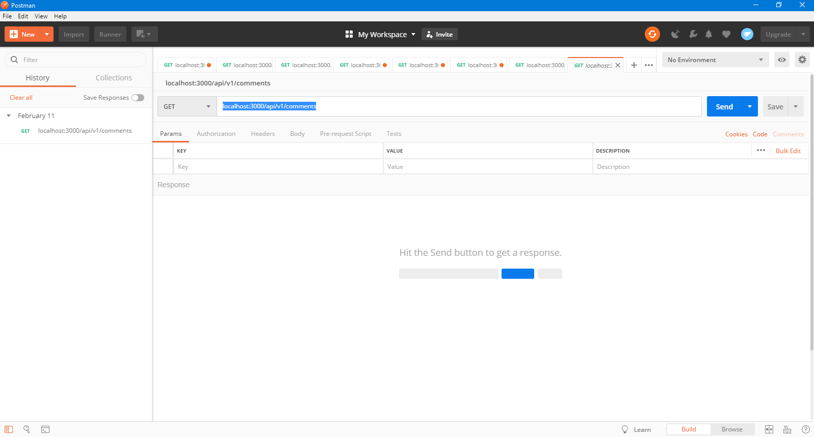
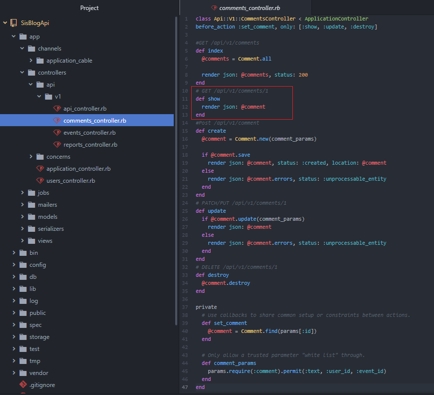
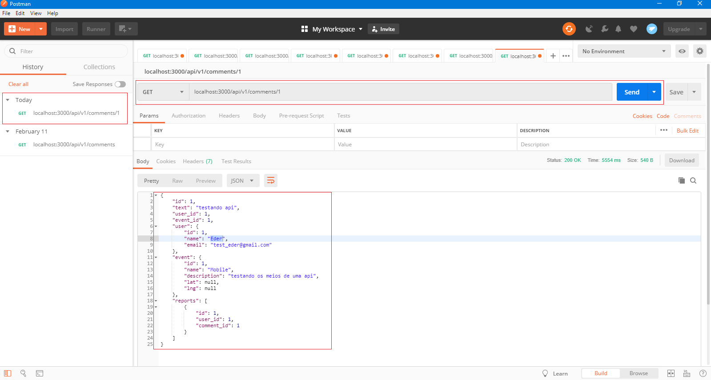
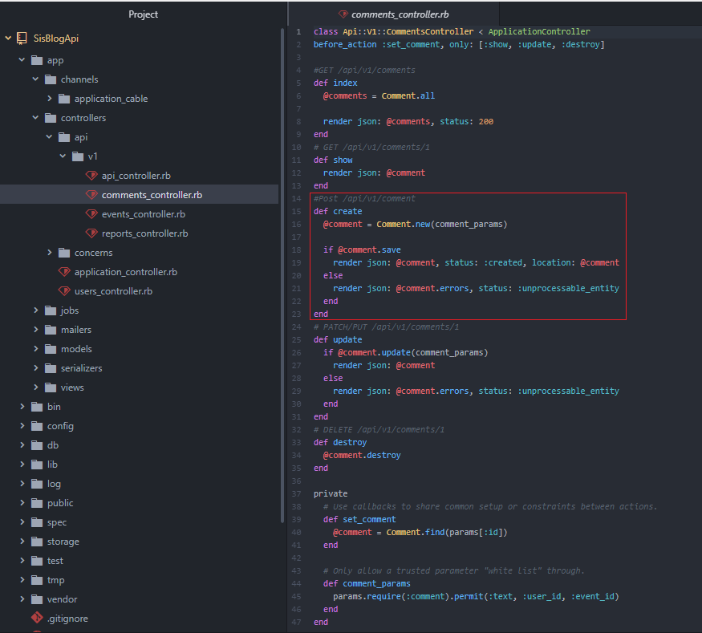
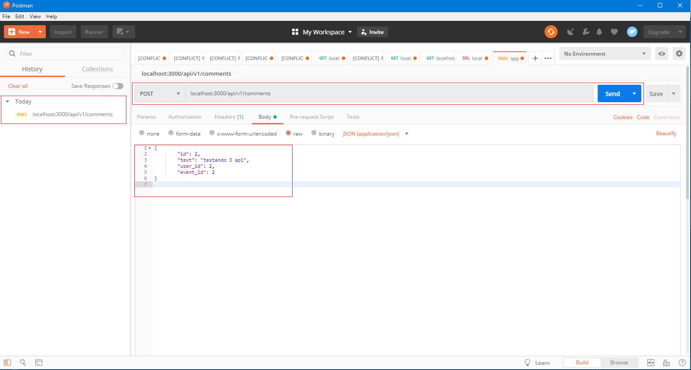
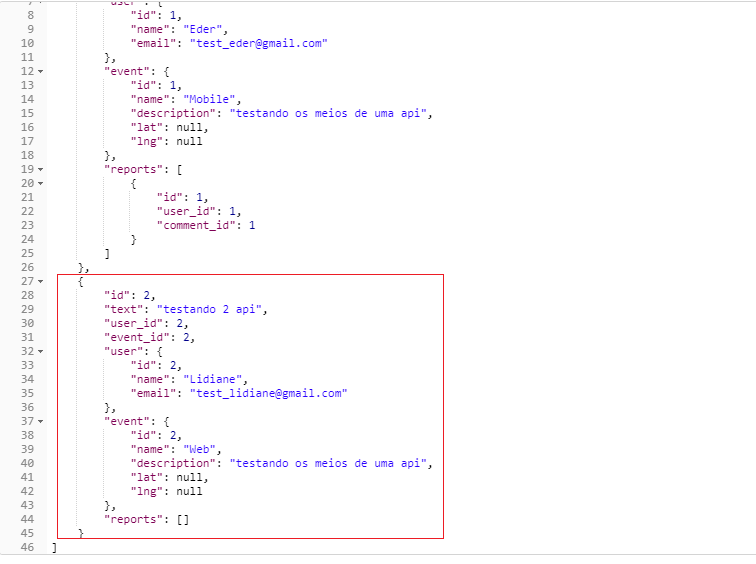
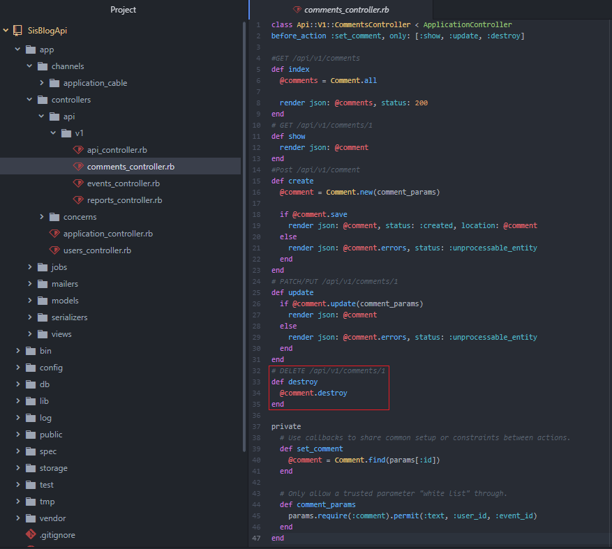
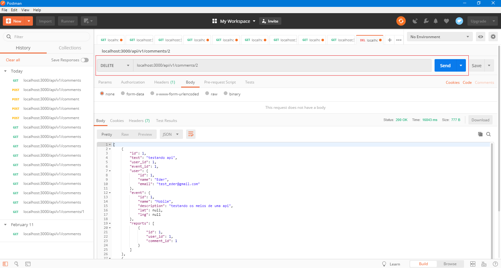
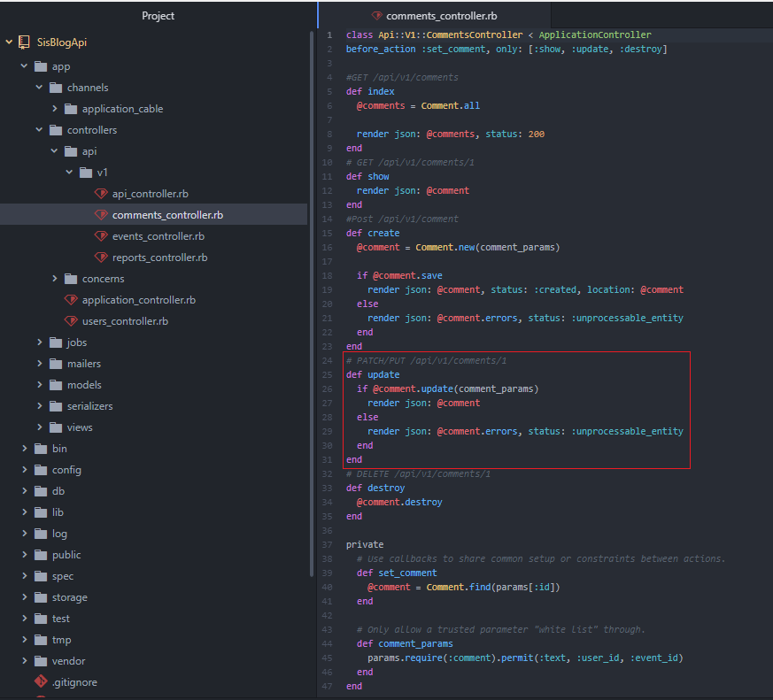
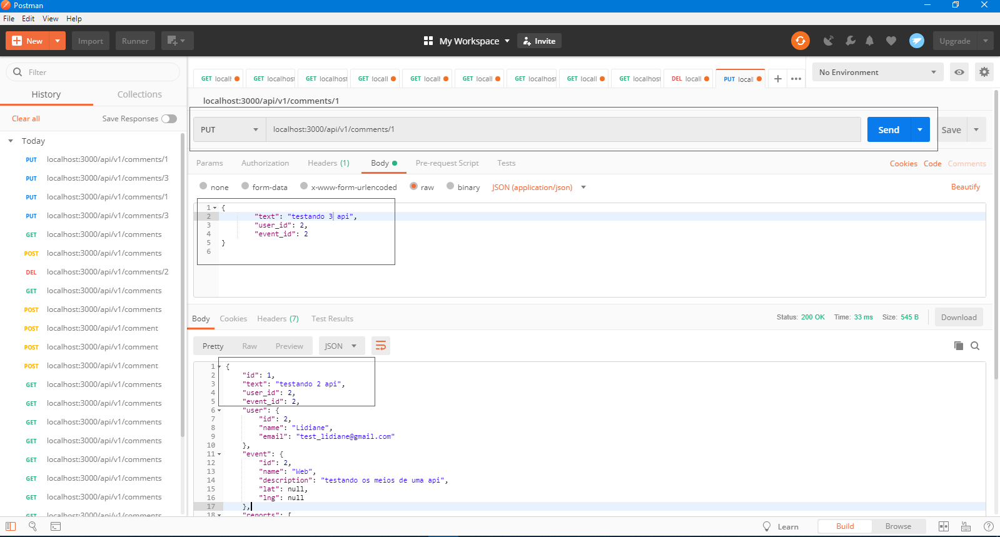

# README
<h1>Como utilizar uma API que responde a solicitações de JSON utilizando Rails (Ruby on Rails 5.2 e MySQL).</h1>

Para começar faça uma verificação de versões do Ruby e Rails, um "git clone" da aplicação e depois de um "bundle install".

Exemplo:

<ol>
<li>Ruby-v a versão do projeto é '2.6.1'</li>
<li>Rails -v a versão do projeto é '~> 5.2.2'</li>
<li>git clone https://github.com/ederCoffani/SisBlogApi.git</li>
<li>bundle install</li>
</Ol>

<h3>Mostrarei como utilizo uma Api simples desenvolvida com rails sem muito esforço.</h3>

Antes vamos verificar se nossa API está realmente funcionando? Para isso estou utilizado o Postman, que simula as requisições GET, POST, DELETE, PUT entre outras, a instalação é super simples, basta adicionar a extensão dele no seu navegador Google chrome (segue o link). Pronto, já está instalado? Vamos lá então! Primeiro execute o comando para subir o servidor do rails, que pode ser acessado em localhost:3000.

$ rails s

Abra o Postman para fazermos uma requisição do tipo GET e retornar todos os artigos que temos cadastrados, iremos usar a rota:

localhost:3000/api/v1/comments

Requisição GET no Postman

Com o Postman aberto siga os seguintes passos:

<ol>
<li>Escolha o método GET;</li>
<li>Informe a rota, que no caso é localhost:3000/api/v1/comments;</li>
<li>Click em send, será exibido a lista de artigos do nosso banco!</li>
</Ol>

Vamos ver a rota criada para mostrar um comentário passando o seu ID, para isso iremos abrir o arquivo app/controller/api/v1/comments_controller.rb e observar o código para rota show que tem por vez um endpoint.

Vamos testar no Postman? Siga os mesmos passo da imagem anterior, só mudando a rota e passando o id do comentário que você deseja obter, exemplo de rota:

localhost:3000/api/v1/comments/1

Será exibido uma resposta com um único comentário:

Agora vamos ver a rota que tem a finalidade de criar um novo comentário, para isso iremos abrir o arquivo comments_controller.rb novamente e observar o código da rota create.

Para fazermos a inserção de um novo artigo pelo Postman é um pouco diferente, no método iremos definir como POST e colocar a rota:

localhost:3000/api/v1/comments

o menu Headers o campo key informe Content-Type e o campo value informe application/json

No menu Body selecione a opção raw e informe no formato json os dados do novo comentário que você deseja salvar, como no exemplo da imagem, em seguida clique em Send, será exibido logo abaixo uma mensagem de sucesso e os dados do novo comentário inserido :)

Logo podemos ver o novo comentários dando um GET novamente em comments

Vamos ver a rota para excluir um comentário? para isso iremos abrir o arquivo comments_controller.rb novamente e observar o código da rota destroy.

Para fazermos a exclusão de um comentário pelo Postman no método iremos definir como DELETE e colocar a rota com o id do comentário que queremos excluir:

localhost:3000/api/v1/comments/2

Ao clicarmos em Send o comentário será excluído.

Agora por último, mas não menos importante, iremos ver a rota para atualizar os dados de um comentário, novamente abriremos o arquivo comments_controller.rb para observar o código da rota update.

No Postman, como faríamos para atualizar? Simples, é só definir o método como PUT e colocar a rota com o id do comentário que queremos atualizar:

localhost:3000/api/v1/comments/1

No menu Headers o campo key informe Content-Type e o campo value informe application/json

No menu Body selecione a opção raw e informe no formato json os dados do comentário que você deseja atualizar, como no exemplo da imagem, em seguida clique em Send, será exibido logo abaixo uma mensagem de sucesso e os dados do novo comentário atualizado.

Conclusão
Pronto! Viu como foi simples testar esta API? Ficou show de bola e aprendemos usar o Postman a consumir essa API. Espero que tenham gostado desse meu projeto!

A! antes de mais nada, fique a vontade para contribuir para esta api ela esta crua mas serve de exemplo para aqueles que ainda não aprendeu sobre API no Rails.

O código do projeto está disponível no meu github até a próxima ;)
